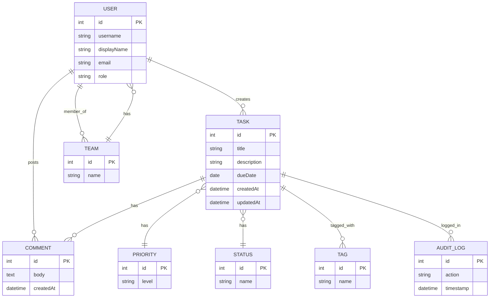
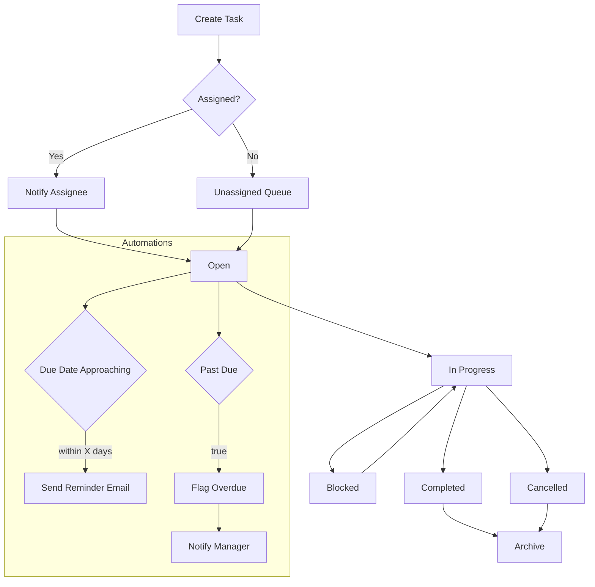
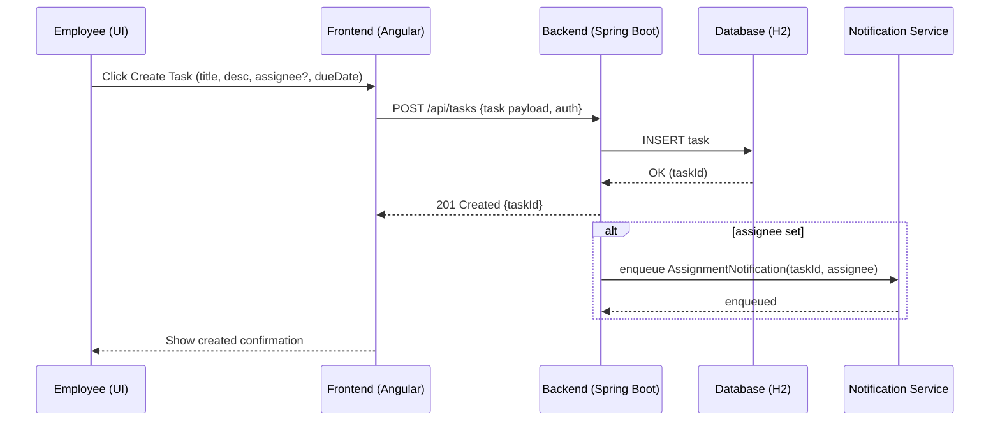
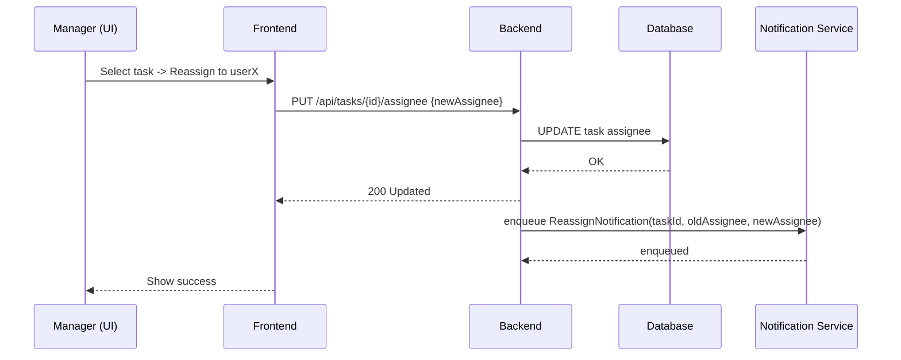
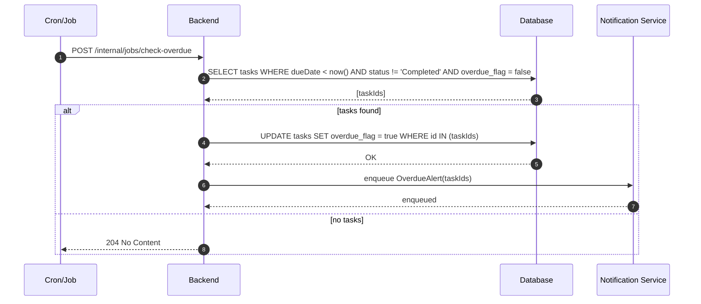
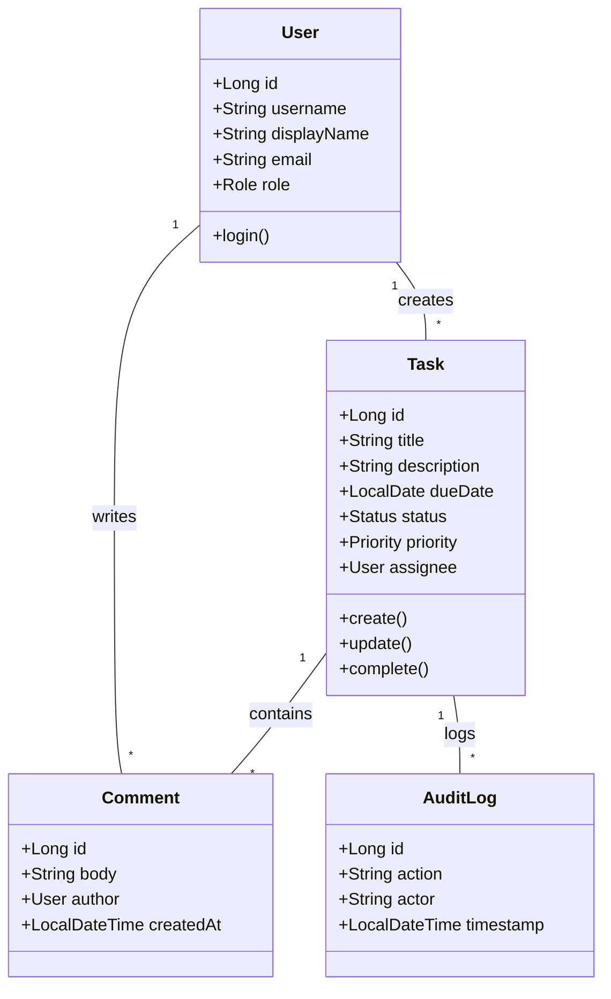

# Internal Task Management Application — Requirements Document

Version: 1.0
Date: 16 December 2025
Prepared for: IT / Operations (Internal)
Prepared by: Business Analyst / Domain Architect

**Purpose**: Formalize the business and system requirements for an internal task-management application built with Java Spring Boot (backend) and Angular (frontend). The application will follow Clean Architecture and Domain-Driven Design principles and serve employees, managers, and admins to centralize task tracking, reminders, and reporting.

**Defaults Adopted for MVP**
- Persistence: H2 embedded in file-mode (persisted across restarts). Recommendation: migrate to PostgreSQL for production.
- Authentication: Generic OIDC (SSO) with optional internal login fallback.
- Notifications: `email` only for MVP; Slack/webhook optional in future phases.
- Expected scale (MVP baseline): ~1,000 total users, ~100 concurrent peak.

**Problem Statement**
- **Problem:** Work and operational tasks are currently tracked in disparate spreadsheets, emails, and ad-hoc notes leading to low visibility, missed deadlines, duplicated effort, and lack of accountability.
- **Solution:** Deliver an internal web application that centralizes task creation, assignment, tracking, reminders, and reporting to improve productivity, visibility, and accountability for employees and managers.

**Primary Actors & Personas**
- **Employee** — Creates and manages personal tasks; updates status, adds comments, marks completion. Needs a simple UI and clear reminders.
- **Manager** — Oversees team tasks, reassigns tasks, views team dashboards and reports, receives overdue alerts.
- **Admin** — Configures system settings (roles, notifications, retention), manages users and audit logs.
- **Executive / Compliance (Reporter)** — Read-only access to aggregated reports and exports for governance.
- **System (Automations)** — Sends reminders, flags overdue tasks, and runs scheduled report exports.

**High-level Features (Epics)**
- **Authentication & User Management**: SSO/OIDC + internal fallback, role management, team mapping.
- **Task Lifecycle Management**: Task CRUD, status workflow, priority, tags, comments.
- **Assignment & Team Management**: Assign to users/teams; manager reassignment for direct reports.
- **Notifications & Reminders**: Email reminders, overdue alerts, optional Slack notifications, calendar sync (future).
- **Reporting & Dashboards**: Personal/team/executive dashboards, CSV/PDF exports, scheduled reports (optional).
- **Search, Filter & Sort**: Full-text (title/description) and faceted filtering.
- **Admin & Audit**: RBAC, audit logging, retention policy, backup schedule.

**Detailed Functional Requirements**
Note: each functional requirement has an ID for traceability.

Authentication & Users
- FR-A1 — Login: Support login via configured SSO provider (OIDC/SAML). Provide optional internal login (username/password) if SSO unavailable.
- FR-A2 — Session Security: Sessions require TLS; session timeout configurable; optional MFA.
- FR-A3 — Roles: System shall support `Employee`, `Manager`, `Admin`, `Executive` roles with RBAC enforcement.

Task CRUD & Metadata
- FR-T1 — Create Task: User can create a task with fields {title (required), description, priority (Low/Medium/High/Critical), status (Open by default), due date, assignee (optional), tags, estimated effort (optional), team}.
- FR-T2 — Update Task: Creator, assignee, manager (of assignee), and Admin can edit task fields; all updates are audit-logged.
- FR-T3 — Delete Task: Admin can soft-delete tasks; soft-deleted tasks remain available for recovery until retention period expiry.
- FR-T4 — Status Workflow: Statuses include `Open`, `In Progress`, `Blocked`, `Completed`, `Cancelled`. Transitions: `Open` -> `In Progress` -> `Completed` (or `Blocked`/`Cancelled` any time), with optional reason for `Blocked/Cancelled`.
- FR-T5 — Assignment & Reassignment: Assignees can reassign to self or request reassign; managers can reassign tasks for users in their team; Admins can reassign any task.
- FR-T6 — Priority & Overdue: System auto-flags tasks overdue when current date > due date and status != `Completed`. Overdue flag visible in list & dashboard.
- FR-T7 — Comments: Users can add timestamped comments; comments are included in audit trails.
- FR-T8 — Tags & Filters: Users can tag tasks and filter by tag.

Notifications & Automations
- FR-N1 — Reminders: System will send configurable reminders: on assignment, X days before due, on due date, and when overdue.
- FR-N2 — Notification Channels: MVP supports `email`. Optional Slack/webhook integration for notifications (configurable by Admin).
- FR-N3 — Escalation: Optional escalation to manager after configurable overdue period (Admin-configurable).

Reporting & Dashboards
- FR-R1 — Personal Dashboard: Shows tasks assigned to current user grouped by status and sorted by due date/priority.
- FR-R2 — Team Dashboard: Managers see aggregated team tasks: counts by status, overdue counts, average time-to-complete.
- FR-R3 — Executive Dashboard: High-level KPIs (completed tasks per period, overdue percentage).
- FR-R4 — Reports Export: Support on-demand exports in CSV; optionally generate downloadable PDF summary for a selected date range.
- FR-R5 — Scheduled Reports: Admin can schedule daily/weekly exports delivered via email to configured addresses (optional).

Search & APIs
- FR-S1 — Search: Fast search by title, description, tags; supports filters by assignee, priority, status, due date, team.
- FR-S2 — API: Provide RESTful JSON APIs for all core operations with API authentication tokens for internal tooling/integration.

Admin & Audit
- FR-ADM1 — Configure Notifications: Admins configure SMTP, Slack webhooks, reminder rules.
- FR-ADM2 — Retention: Admin sets retention windows; system soft-deletes then permanently purges per policy.
- FR-ADM3 — Audit Log: All create/update/delete and authentication events logged with user id, timestamp, action, and delta; logs exportable.

UI/UX
- FR-UX1 — Responsive UI: Desktop-first layout, responsive to mobile widths.
- FR-UX2 — Accessibility: Basic keyboard navigation and semantic HTML; full WCAG conformance as future enhancement.
- FR-UX3 — Empty States & Help: Provide inline help and empty-state guidance for first-time users.

Acceptance Criteria (MVP)
- AC-1 — Users can authenticate and see their personal dashboard.
- AC-2 — Create/assign/update/complete a task and receive email notification on assignment.
- AC-3 — Overdue tasks flagged automatically and appear on manager dashboards.
- AC-4 — Managers can reassign tasks for their direct reports.
- AC-5 — Admin can configure SMTP and download report CSV.

**Non-Functional Requirements**
Security
- NFR-S1 — Transport encryption: All traffic via HTTPS/TLS (TLS1.2+).
- NFR-S2 — Authentication: SSO via OIDC/SAML. Internal login fallback with secure password hashing (bcrypt or Argon2).
- NFR-S3 — Authorization: RBAC enforced at API and UI layers.
- NFR-S4 — Audit & Logging: All security-sensitive events and data changes are logged; logs retained per retention policy and available for export.
- NFR-S5 — Data Protection: Sensitive fields encrypted at rest if persisted beyond H2 (recommend production DB encryption). Backups encrypted.

Performance & Scalability
- NFR-P1 — Page load (UI): Median page load < 2s under normal load.
- NFR-P2 — API latency: Median API response time < 200ms for reads; < 500ms for writes under expected load.
- NFR-P3 — Concurrency: Support baseline assumption (e.g., 1k users / 100 concurrent). System should scale horizontally for higher concurrency via stateless backend + external DB.
- NFR-P4 — Caching: Use short-term caches (in-memory or Redis) for dashboard aggregations to meet response SLAs.

Availability & Reliability
- NFR-A1 — Availability: 99.9% uptime target for the application.
- NFR-A2 — Backup & Restore: Daily backups and tested restore procedures; RTO < 4 hours (MVP target), RPO < 24 hours.
- NFR-A3 — Health Monitoring: Health endpoints, metrics, alerting into Ops/DevOps channels.

Operational
- NFR-O1 — Deployments: CI/CD with blue/green or rolling deployments to avoid downtime.
- NFR-O2 — Observability: Centralized logs, metrics, and dashboards (e.g., Prometheus/Grafana or cloud provider equivalents).

**System Assumptions & Constraints**
- SC-1 — Single-tenant internal app (no multi-tenancy). All users are internal employees.
- SC-2 — Language: English-only for MVP.
- SC-3 — Data store for MVP: H2 (embedded). Note: H2 in-memory does not persist across restarts. For daily backups and persistence use H2 file-mode or prefer Postgres for production; daily backups require a persisted data store or export procedure.
- SC-4 — Notifications: Email required for MVP; Slack and calendar sync are optional/in future phases.
- SC-5 — Managers map to team membership in directory (SSO / LDAP / internal mapping). Manager reassign scope limited to direct reports unless Admin overrides.
- SC-6 — No external users or partner APIs are required in MVP.
- SC-7 — Files/attachments are planned for future phases (not in MVP).

**Architecture Recommendations (High-level)**
- Backend: Spring Boot (Java 17+) structured with Clean Architecture layers — API (controllers) → Application Services (use-cases) → Domain (entities, aggregates, value objects, domain services) → Infrastructure (persistence, messaging, email).
- Frontend: Angular (latest LTS) with feature modules: auth, tasks, dashboard, admin, reports.
- Persistence: H2 file-mode for MVP, migrate to PostgreSQL in production; use JPA/Hibernate with clear repository interfaces.
- Messaging: For future async notifications & escalations use lightweight message broker (RabbitMQ or cloud-native SNS/SQS).
- CI/CD / Hosting: Cloud hosting (AWS/Azure/GCP) with managed DB for production, daily backups, and monitoring.

**Risks & Mitigations**
- R-1 — H2-in-memory is unsuitable for production if you need daily backups and HA. Mitigate by planning migration to Postgres early and limiting H2 to dev/MVP or file-mode with export.
- R-2 — SSO provider choice affects user/team provisioning. Decide early and plan SCIM/LDAP sync if required.
- R-3 — Notifications and escalations require careful rate-limiting to avoid alert spam.

**Open Questions / Decisions to Finalize**
- Q1 — Confirm persistence approach: H2 file-mode vs production DB (Postgres). If H2 file-mode chosen, confirm backup mechanism.
- Q2 — Confirm SSO provider (Okta/AzureAD/Google/Generic OIDC) and whether internal login fallback is required.
- Q3 — Confirm notifications for MVP: `email` only or `email + Slack`?
- Q4 — Confirm report export formats and any scheduled distribution requirements.
- Q5 — Provide approximate user counts and concurrency expectations.
- Q6 — Confirm manager reassignment policy (direct reports only vs cross-team).
- Q7 — Time zone handling for due dates — assume user's local timezone with server normalization.

**Risks & Recommendations**
- R-1 — H2 file-mode limits durability and scaling — plan Postgres migration early
- R-2 — Decide SSO early; provisioning/SCIM impacts project scope
- R-3 — Apply rate-limiting for notifications and provide Admin controls

**Next Steps / Suggested Implementation Roadmap (MVP)**
- 1 — Approve clarifying decisions (persistence, SSO, notifications, user counts).
- 2 — Create high-level architecture diagram: Spring Boot API (stateless) + H2 (dev) / Postgres (prod) + Angular client + SMTP/Slack integration + CI/CD + cloud hosting.
- 3 — Implement Authentication + User Management, Task CRUD, basic dashboards, email notifications, manager reassignment rules.
- 4 — Add reporting, scheduled exports, and admin settings.
- 5 — Run security review, performance tests, and a restore-from-backup drill.

Would you like me to scaffold a minimal project skeleton (Spring Boot + Angular) with the Clean Architecture folder layout and a small seed database using H2 file-mode? If yes, I will scaffold the backend and frontend skeletons and provide run instructions.

---
## Diagrams (Mermaid)

Below are four diagrams in Mermaid syntax: an ER diagram, a flow diagram (task lifecycle), a use-case diagram, and a UML class diagram. You can render these in any Markdown viewer that supports Mermaid.

### 1) ER Diagram

### 2) Flow Diagram (Task lifecycle)

### 3) Sequence Diagrams (key workflows)

Below are Mermaid sequence diagrams that represent the main interactions for three core workflows: Create Task, Manager Reassign Task, and Overdue Automation.

#### 3.1 Create Task

#### 3.2 Manager Reassign Task

#### 3.3 Overdue Automation

### 4) UML Class Diagram (simplified)

